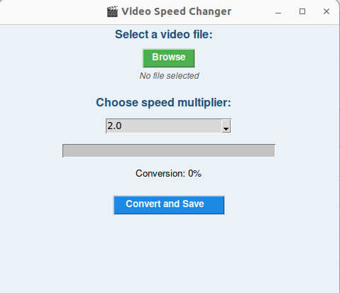

# 🎬 Video Speed Changer

A desktop GUI app (built in Python with Tkinter) to easily speed up or slow down any video file (MP4, AVI, etc).

## 🚀 Features

- Speed up or slow down video (0.25x to 10x)
- Estimate output file size
- Show video duration
- Open folder after saving
- Cross-platform compatible (Windows/Linux/macOS)
- Icon-supported desktop UI

## 📦 Requirements

- Python 3.7+
- OpenCV (`opencv-python`)

```bash
pip install -r requirements.txt

python run.py

## 🖼️ App Preview


